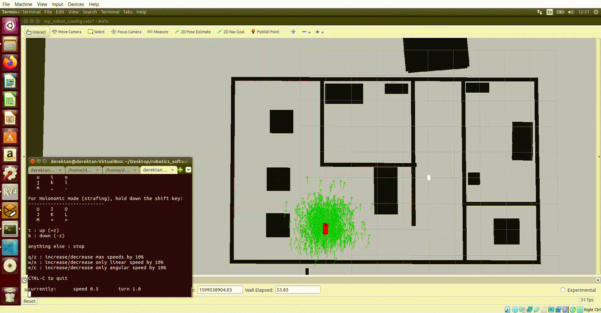

# Robotics Software Engineering Nanodegree (Udacity)

**Disclaimer:** Udacity provided some starter code, but the implementation for these concepts are done by myself. Please contact derektan95@hotmail.com for any questions. 

### Certificate of Completion 
https://confirm.udacity.com/LHFY5GCD

### Summary 
This course aims to educate more about localization and navigation principles pertaining to autonomous robots, using a commonly used platform called Robot Operating System (ROS). It covers topics ranging from Gazebo simulation, communcation between ROS nodes, localization using Extended Kalman Filter or Particle Filter, Simultaneous Localization & Mapping (SLAM) and A* Path Planning. All of these techniques culminates to a final project where a home service robot capable of localization and navigation is developed. Instructions for compiling each project is available on each project's subdirectory.

**Note:** These projects are developed in **Ubuntu 16.04** and **ROS Kinetic**. Please clone the `master` branch for latest version of all projects. The `with_cmake_files` branch contains cmake files from my computer, which will be irrelevant for you. For folders in catkin workspaces, `catkin_ws`, please run `catkin_make` to build the catkin workspace.

## Gazebo World Segment 
**Gazebo** is a useful simulation tool that can be used with ROS to render robots in a simulated environment. It comes with a model and world editor, along with presets models, that can allow for quick prototyping of a physical environment.

The main principles taught in this segment are: 
1) Using model editor tool to render a robot with specified links & joints
2) Using World editor tool to render an environment (e.g. a house)
3) Running plugins on launch of Gazebo platform

## ROS Essentials Segment 
**Robot Operating System** is a middleware designed for communication between different robotic parts, as well as common useful packages that can be used for robotic applications. In this project, different communication models were employed for different nodes of the robot to allow the robot to drive towards a white ball whenever the robot observes it. From a high level, the 2D camera node continuously checks whether the white ball in sight, and the angle of the ball relative to the robot's heading. If white ball is in sight, a service is called to the drive node to drive towards the ball with specified linear and rotational velocity. The drive node receives this service call and publishes motion information robot's wheel actuation node for movement. 

The main principles taught in this segment are: 
1) Packages & Catkin Workspaces
2) Writing ROS nodes & communication models (Publisher-Subscriber, Service-Client)

## Localization Segment 
2 common localization principles are the **Extended Kalman Filter (EKF)** and **Monte Carlo Localization (Particle Filter)**. Given a map of the surrounding, motor controls and sensor readings, the robot can use either of these principles to estimate its state position. In this project, I made use of the **Adaptive Monte Carlo Package** from ROS (http://wiki.ros.org/amcl). The robot starts off with a known map, with particles of equal probability weights generated randomly around the robot (shown as **green arrows**). As the robot moves, the particles likewise move. Each particle will then be assigned a probability denoting the likelihood of it being in its position and orientation, by comparing laser distance readings and the distance between it's own position to landmarks on the map. The higher the probability, the more likely a particle will survive in the resampling stage. After multiple timesteps of movement, we can observe that the **green arrows** converges accurately on the true location on the robot, indicating precise localization. 

The main principles taught in this segment are: 
1) Extended Kalman Filter
2) Adaptive Monte Carlos Localization (Particle Filter)

## Mapping & SLAM Segment 
A common mapping algorithm is the **Occupancy Grid Mapping**. Using sensor measurements and the Binary Bayes Filter, it computes the likelihood of an obstacle (i.e. map) given a particular grid on the map. Mapping requires the knowledge of the robot's start position, motor controls and sensor readings.

**Simulataneous Localization and Mapping (SLAM)** combines principles from both localization and mapping. Using sensor readings and motor control, the robot can continuously map the surroundings, and use the map data to localize itself relative to it. The **Online SLAM approach** gives the map and robot's pose at a given point of time, while the **Full SLAM approach** gives the map and all past robot poses. The main techniques taught in this class is the **Grid-Based FastSLAM** and **GraphSLAM**, which are Online Slam and Full Slam approaches respectively. In this project, the **Real Time Appearance Based Mapping** is used as part of the Online SLAM approach, where a depth camera is used. It provides **3D localization and mapping**, with the ability to perform **loop closure** (i.e. identify previously visited locations to allow for smoother map generation). 

This is available as a ROS package (http://wiki.ros.org/rtabmap_ros). Please build the rtab package from source by following the instructions in the RTAB-github link (https://github.com/introlab/rtabmap_ros).

The main principles taught in this segment are: 
1) Occupancy Grid Mapping (Binary Bayes Filter)
2) Grid-Based FastSLAM
3) GraphSLAM
4) RTAB-map SLAM (Variant of GraphSLAM)

## Path Planning & Navigation Segment 
There are 3 main approaches of path planning algorithms, namely **discrete, sample-based and probabilistic approaches**. These approaches differes in how the configuration space is broken down into maps and how paths are planned. In this project, the environment is pre-mapped using a ROS package called **gmapping** (http://wiki.ros.org/gmapping), which is based off of **2D Grid-Based FastSLAM** without loop closure capabilities. The **Adaptive Monte Carlo Localization package** from ROS (http://wiki.ros.org/amcl) is used to localize the robot at any point of time. The **ROS navigation stack** (http://wiki.ros.org/navigation), which leverages on the Dijkstra algorithm is used for the home service robot to simulate pickup and dropoff at preset points. Please run `home_service.sh` in src/shellscripts/ for quick launch of simulation.

The main principles taught in this segment are: 
1) Path Planning Algorithms
2) Simulating pickup and dropoff by combining all techniques learnt thus far

