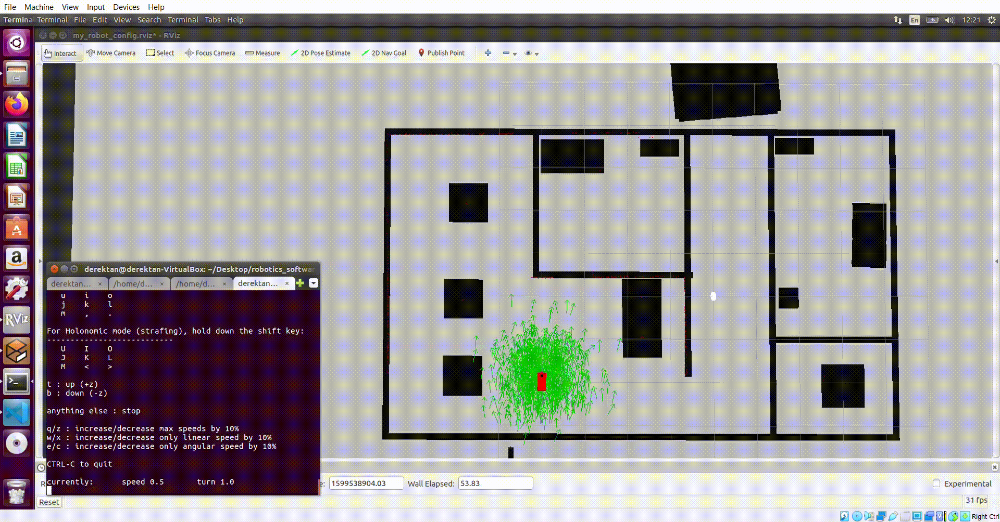

# Localization Segment

2 common localization principles are the **Extended Kalman Filter (EKF)** and **Monte Carlo Localization (Particle Filter)**. Given a map of the surrounding, motor controls and sensor readings, the robot can use either of these principles to estimate its state position. In this project, I made use of the **Adaptive Monte Carlo Package** from ROS (http://wiki.ros.org/amcl). The robot starts off with a known map, with particles of equal probability weights generated randomly around the robot (shown as **green arrows**). As the robot moves, the particles likewise move. Each particle will then be assigned a probability denoting the likelihood of it being in its position and orientation, by comparing laser distance readings and the distance between it's own position to landmarks on the map. The higher the probability, the more likely a particle will survive in the resampling stage. After multiple timesteps of movement, we can observe that the **green arrows** converges accurately on the true location on the robot, indicating precise localization. 

The main principles taught in this segment are: 
1) Extended Kalman Filter
2) Adaptive Monte Carlos Localization - AMCL (Particle Filter)

## Setup 
Use the following commands to build the project: 

1. Navigate to catkin workspace root directory: `cd catkin/`
2. Compile Catkin Workspace: `catkin_make`
3. Launch Robot in world: `source devel/setup.bash && roslaunch my_robot world.launch`
4. Launch AMCL package **(new tab)**: `source devel/setup.bash && roslaunch my_robot amcl.launch`
5. Launch Teleops package **(new tab)**: `source devel/setup.bash && rosrun teleop_twist_keyboard teleop_twist_keyboard.py`
